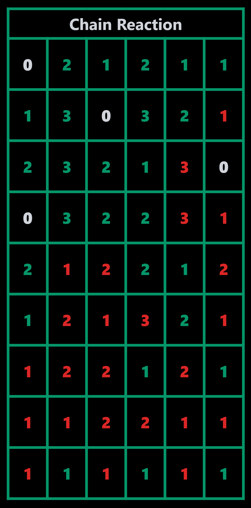

# Chain Reaction

Recreating [Chain Reaction](https://play.google.com/store/apps/details?id=com.BuddyMattEnt.ChainReaction&hl=en_IN&gl=US) game.



# Installation
- Front-end
  ```bash
  git clone https://github.com/RtiM0/chainreaction.git
  cd chainreaction
  npm install
  npm run start
  ```
- Back-end
  ```bash
  git clone https://github.com/RtiM0/chainreaction-api.git
  cd chainreaction-api
  npm install
  node server.js
  ```
- Change in ``chainreaction/src/socket.js``  ``line 4``for debug env:
  ```javascript
  export const socket = socketio.connect('http://127.0.0.1:8080');
  ```
- Change in ``chainreaction-api/server.js`` ``line8`` for debug env:
  ```javascript
  const io = new Server(server, {cors: {origin: '*'}});
  ```
  

# TODO

- Use React, Express, Mongo and Socket.io to make it a multiplayer.
